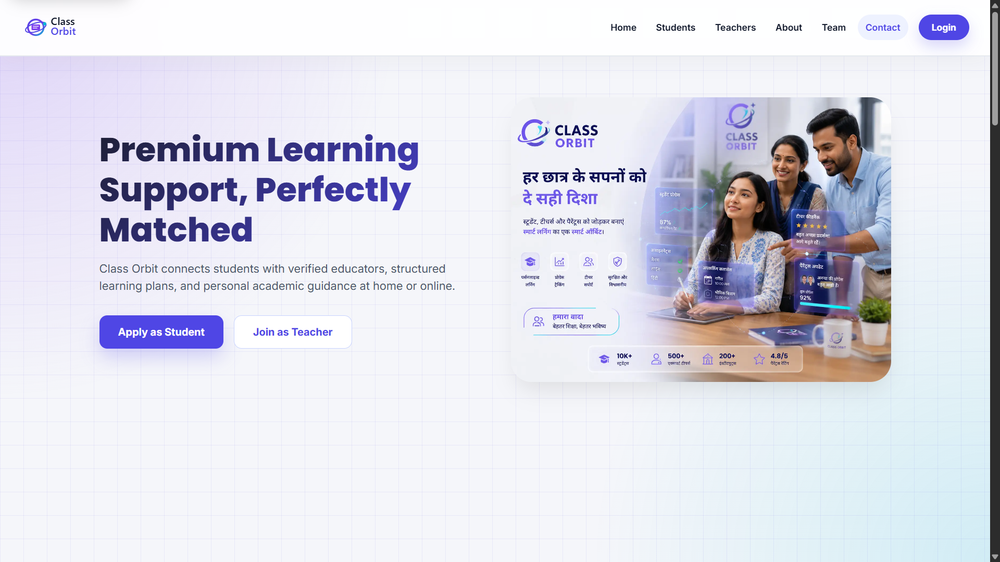
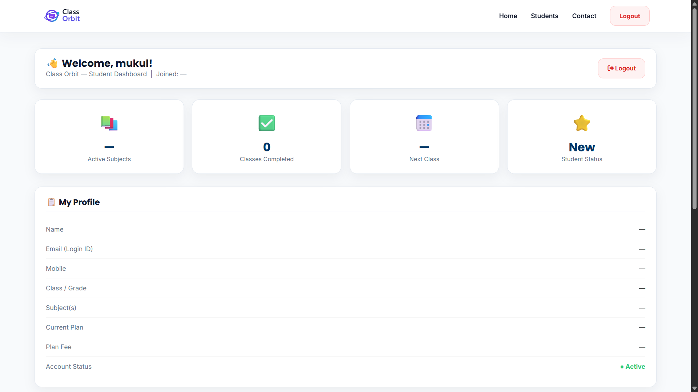
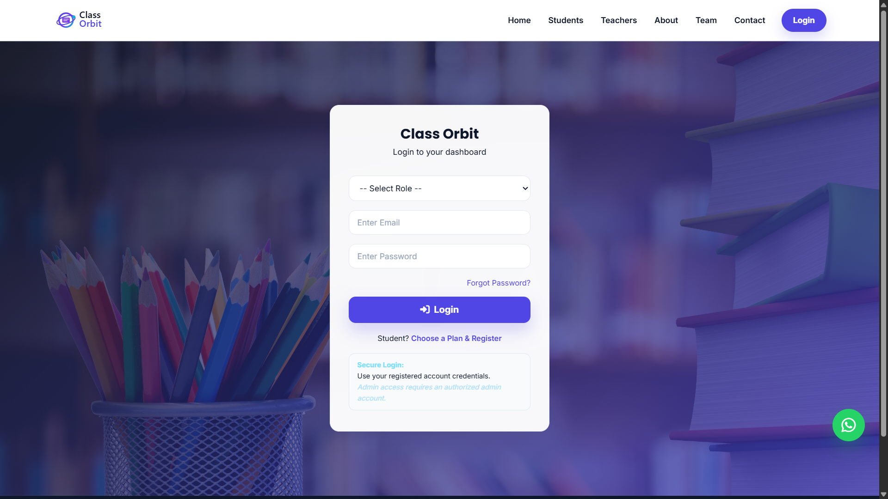
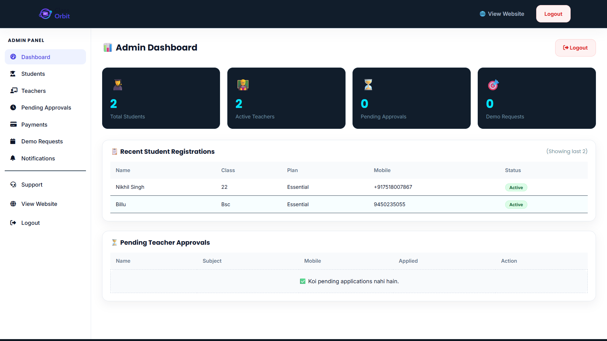
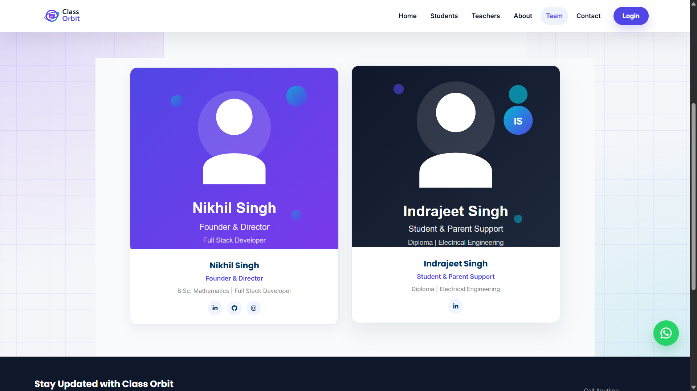
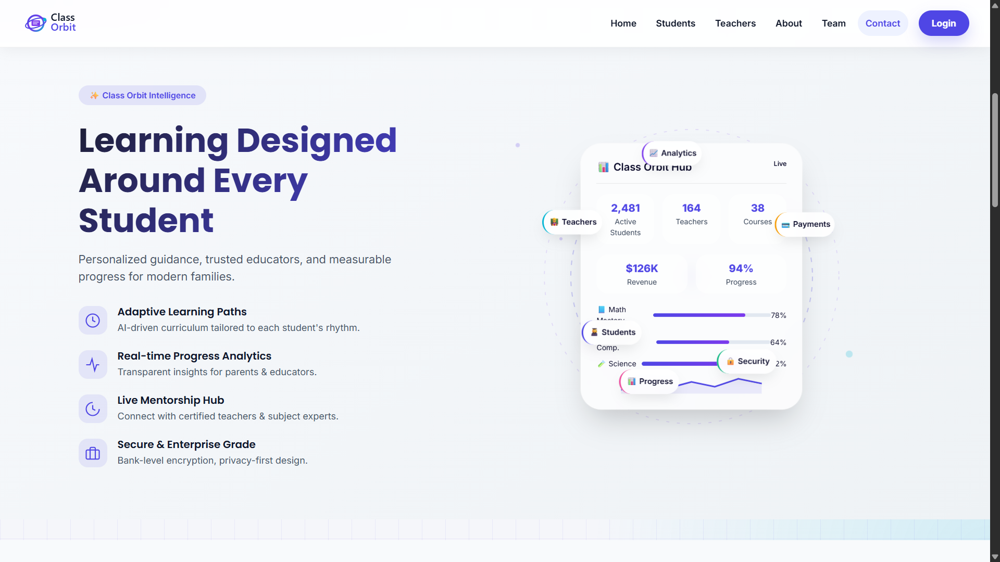

# 🎓 Class Orbit

### Full-Stack Education Platform

[](https://class-orbit.netlify.app/)
[](https://github.com/nikhil-mca-code/class-orbit)

---

## 🚀 Overview

Class Orbit is a modern full-stack education platform designed to streamline interactions between students, teachers, and administrators.

The platform provides secure authentication, role-based dashboards, payment processing, email automation, and administrative workflows through a scalable REST API architecture.

---

## 🛠 Tech Stack

### Frontend


### Backend


### Database


### Authentication & Security


### API Integrations


### Deployment


---

## ✨ Key Features

### 🔐 Authentication & Security

* JWT Authentication
* Role-Based Access Control
* Password Reset Workflow
* Protected Admin Routes
* Helmet Security Middleware
* API Rate Limiting
* Environment-Based Configuration

### 👨‍🎓 Student Portal

* Student Registration & Login
* Personalized Dashboard
* Profile Management
* Demo Booking
* Course Enrollment Workflow

### 👩‍🏫 Teacher Portal

* Teacher Registration
* Teacher Dashboard
* Subject Application Workflow
* Approval & Verification Process

### 👨‍💼 Admin Portal

* Secure Admin Dashboard
* Student Management
* Teacher Management
* Payment Management
* Demo Request Management
* Platform Statistics

### 💳 Payment System

* Razorpay Integration
* Secure Order Creation
* Server-Side Payment Verification
* Payment Validation Workflow

### 📧 Communication System

* Brevo Email API Integration
* Newsletter Subscription
* Contact Form
* Automated Notifications
* Password Reset Emails

---

## 🏗 Architecture

```text
Client (Frontend)
        │
        ▼
Express REST API
        │
        ▼
Authentication Layer
        │
        ▼
MongoDB Database
        │
 ┌──────┴──────┐
 ▼             ▼
Razorpay     Brevo
Payments     Email API
        │
        ▼
Admin Dashboard
```

---

## 📊 Project Highlights

✅ Full-Stack Architecture

✅ REST API Design

✅ JWT Authentication

✅ Razorpay Integration

✅ Brevo Email API Integration

✅ MongoDB Database Design

✅ Role-Based Access Control

✅ Production Deployment

---
# 📂 Project Structure

```bash
class-orbit/
│
├── backend/
│   ├── config/
│   ├── controllers/
│   ├── middleware/
│   ├── models/
│   ├── routes/
│   ├── payment/
│   ├── utils/
│   ├── server.js
│   └── package.json
│
├── frontend/
│   ├── assets/
│   ├── css/
│   ├── js/
│   ├── images/
│   ├── index.html
│   ├── login.html
│   ├── register.html
│   ├── student-dashboard.html
│   ├── teacher-dashboard.html
│   └── admin.html
│
├── README.md
├── SETUP.md
└── .env.example
```

---

# ⚙️ Installation

### Clone the Repository

```bash
git clone https://github.com/nikhil-mca-code/class-orbit.git
```

### Navigate to the Project

```bash
cd class-orbit
```

### Install Backend Dependencies

```bash
cd backend
npm install
```

### Configure Environment Variables

```bash
cp .env.example .env
```

### Start Development Server

```bash
npm run dev
```

### Run Frontend

Open the frontend using:

* Live Server Extension
* Local Development Server
* Netlify Deployment

---

# 🔑 Environment Variables

Create a `.env` file in the backend directory.

```env
PORT=

MONGO_URI=

JWT_SECRET=

BREVO_API_KEY=

RAZORPAY_KEY_ID=
RAZORPAY_KEY_SECRET=

FRONTEND_URL=

CORS_ORIGINS=
```

---

# 🔌 API Overview

## Authentication

```http
POST /api/auth/register
POST /api/auth/login
POST /api/auth/forgot-password
POST /api/auth/change-password
```

---

## Student

```http
POST /api/student/register
GET /api/student/profile
```

---

## Teacher

```http
POST /api/teacher/register
GET /api/teacher/profile
```

---

## Demo Booking

```http
POST /api/demo/book
```

---

## Contact

```http
POST /api/contact/send
```

---

## Newsletter

```http
POST /api/newsletter/subscribe
```

---

## Payments

```http
POST /api/payment/create-order
POST /api/payment/verify
```

---

## Admin

```http
GET /api/admin/students
GET /api/admin/teachers
GET /api/admin/payments
GET /api/admin/statistics
```

---

# 🔒 Security Measures

### Authentication

* JWT Authentication
* Secure Token Validation
* Password Hashing with bcrypt

### Authorization

* Role-Based Access Control
* Protected Admin Routes
* Protected Teacher Routes

### Infrastructure Security

* Helmet Security Headers
* API Rate Limiting
* Environment Variable Protection
* Input Validation

### Payment Security

* Razorpay Signature Verification
* Server-Side Payment Validation

---

# 🚀 Future Roadmap

## Academic Features

* Course Management Module
* Assignment Submission System
* Attendance Tracking
* Student Progress Reports

## Communication Features

* Real-Time Notifications
* Chat System
* Discussion Forums

## Platform Features

* Analytics Dashboard
* Admin Insights
* Advanced Search
* Role Permissions Management

## Mobile Experience

* Progressive Web App (PWA)
* Android Application
* Mobile-Optimized Dashboard

---

## 📸 Platform Screenshots

<table>
<tr>
<td align="center">
<b>Home Page</b><br><br>

</td>

<td align="center">
<b>Student Dashboard</b><br><br>

</td>
</tr>

<tr>
<td align="center">
<b>Login Dashboard</b><br><br>

</td>

<td align="center">
<b>Admin Dashboard</b><br><br>

</td>
</tr>

<tr>
<td align="center">
<b>Team Section</b><br><br>

</td>

<td align="center">
<b>About Section</b><br><br>

</td>
</tr>
</table>


---

# 🌟 Why This Project Matters

Class Orbit demonstrates practical experience with:

* Full-Stack Development
* REST API Design
* Authentication Systems
* Payment Gateway Integration
* Email Automation
* Database Modeling
* Security Best Practices
* Production Deployment

This project was built to solve real educational workflow challenges while strengthening software engineering and backend development skills.

---

# 👨‍💻 Author

### Nikhil Singh

Software Development Intern | Full-Stack Developer

📧 Email:
[nikhil.mca.in@gmail.com](mailto:nikhil.mca.in@gmail.com)

💼 LinkedIn:
https://www.linkedin.com/in/nikhil-mca-in/

🐙 GitHub:
https://github.com/nikhil-mca-code

🌐 Website:
https://gorakhpurwebstudio.in/

---

# 📜 License

This project is intended for educational, learning, and portfolio purposes.

---

## ⭐ If you found this project interesting, consider giving it a star!
